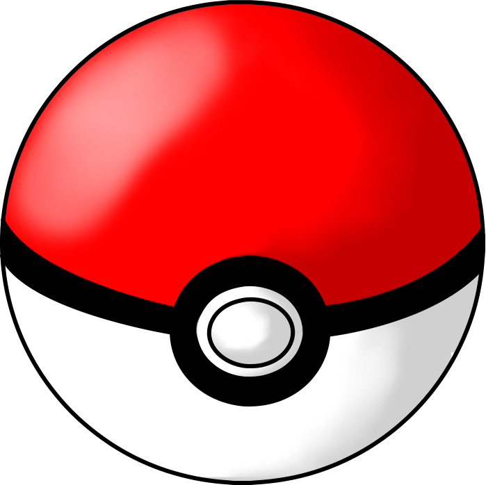

# Pikachu Rescue 

- An simple 2-d game built using OpenGL library , and written in C++.
- Game consists of 3 levels , with each level the difficulty increases
  - the number of walls 
  - the number of enemies
- the Enemy ( Meowth ) moves in random direction : 
  - up-down or 
  - right-left 
  
### **Objective**  : 
  - to dodge the enemy , reach the exit gate to pass onto the next level , while collecting the pokemon balls , scattered randomly across the level , for each ball collected , player gets a +1 point score.
  - The game ends after level 3 
  - Player could play the game with lights turned off for extra points ( +5 points)

### **Controls**

1. Press <kbd>ENTER</kbd> to start the game

2. <kbd>W</kbd> , <kbd>A</kbd> , <kbd>S</kbd> , <kbd>D</kbd> for player movements 
   
3. <kbd>L</kbd> for toggling the light switch
   
   

   
### Actors on the Screen  : 
    
### **Player** : 
  

### **Enemy** : 

    
### **PokeBall** :

### Game Scenarios 

